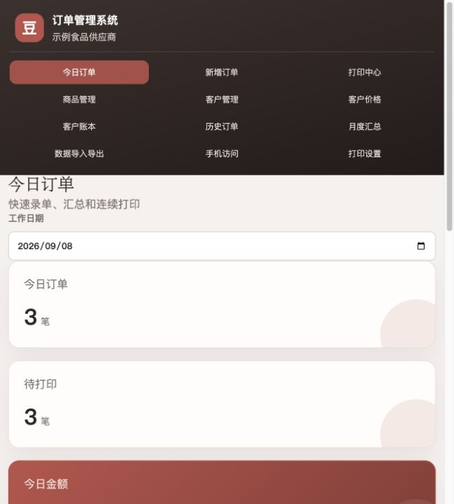
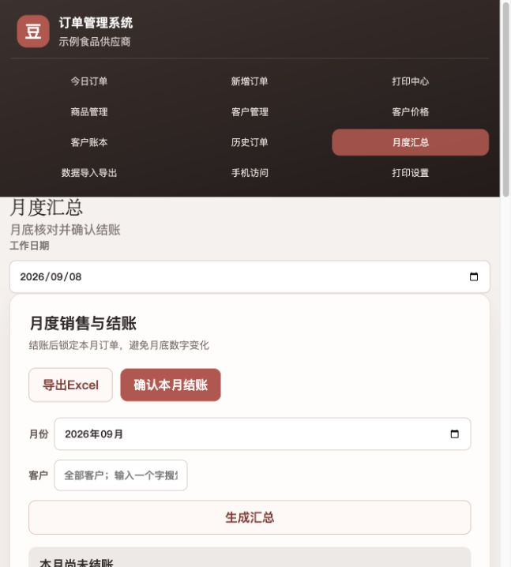

# Local-First Order Management System

[](https://github.com/zhangxin714/local-first-order-management-system/actions/workflows/test.yml)

An AI-assisted, local-first order management system designed for a small food
supplier moving away from an error-prone Excel workflow.

## Screenshots

### Daily order dashboard



### Monthly summary and closing



## Why this project exists

The original workflow required repeated manual entry, customer-specific prices,
monthly reconciliation and a fixed three-copy continuous-form printer. This
project models those rules explicitly so that calculations, historical prices
and accounting records remain consistent.

## Features

- Customer and product management with customer-specific pricing
- Order entry with quantity and monetary validation
- Historical price snapshots, so later price changes do not rewrite old orders
- Fixed-point money calculations (integer cents) to avoid floating-point errors
- Copy-previous-order workflow using the current effective price
- Offline mobile order queue with duplicate-sync protection
- Printable three-customer continuous-form layout with millimetre coordinates
- Monthly sales reports, customer ledgers, payments and month closing
- Excel import preview and monthly Excel export
- SQLite persistence, automatic backup support and automated domain tests

## Technology

- Node.js (ES modules)
- SQLite
- HTML, CSS and vanilla JavaScript
- ExcelJS for workbook export
- Node.js built-in test runner

## Run locally

```bash
pnpm install
pnpm demo:seed
pnpm start
```

The application is intended to run as a local service. `pnpm demo:seed` creates
only synthetic data in the ignored `data/demo.sqlite` file; it is safe to use
for demonstrations and is never committed to the repository.

Run the automated tests with:

```bash
pnpm test
```

## Engineering decisions demonstrated

1. Money is stored as integer cents and quantities as integer thousandths.
2. Orders store product, customer, price and amount snapshots for historical
   integrity.
3. Printed orders are protected from accidental edits.
4. Offline mobile requests carry a client request ID so retries are idempotent.
5. The print layout uses fixed millimetre coordinates instead of responsive
   layout rules, because physical printer output is part of the requirement.

## AI-assisted development disclosure

Codex was used to generate and refactor parts of the implementation. I defined
the business requirements, data model, validation rules, test cases and printer
constraints; reviewed the generated code; ran the system against the workflow;
and iterated on the implementation and tests. I am continuing to study the
codebase and add features through small, explainable changes.

## Privacy

This is a sanitised portfolio copy. Real customer names, telephone numbers,
addresses, prices, orders, databases and backups must never be committed. See
[`PRIVACY.md`](PRIVACY.md) before publishing changes.
